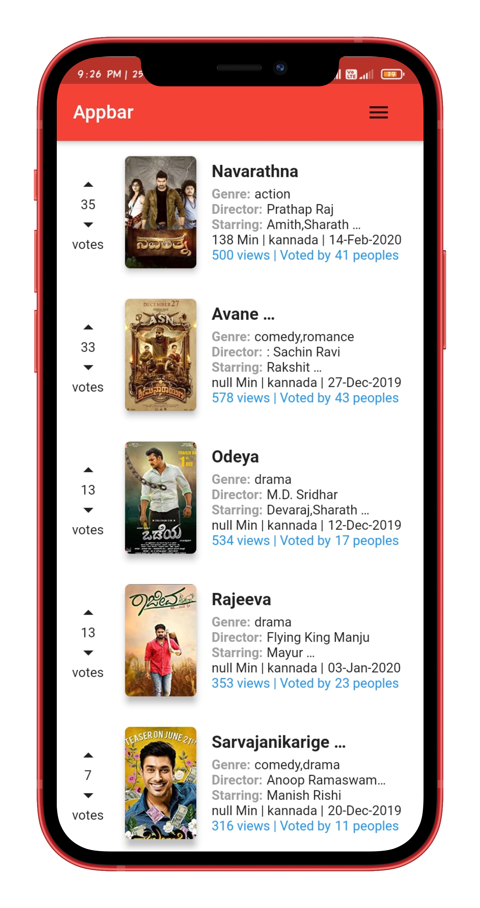

# movies

A new Flutter project.

## Getting Started

To get a local copy up and running follow these simple example steps.

### Prerequisites


* Flutter
* Firestore ID


### Installation

1. Clone the repo

```sh
git clone https://github.com/faizm55212/furns_grid_flutter.git
```

3. Install packages

```sh
flutter pub get
```

